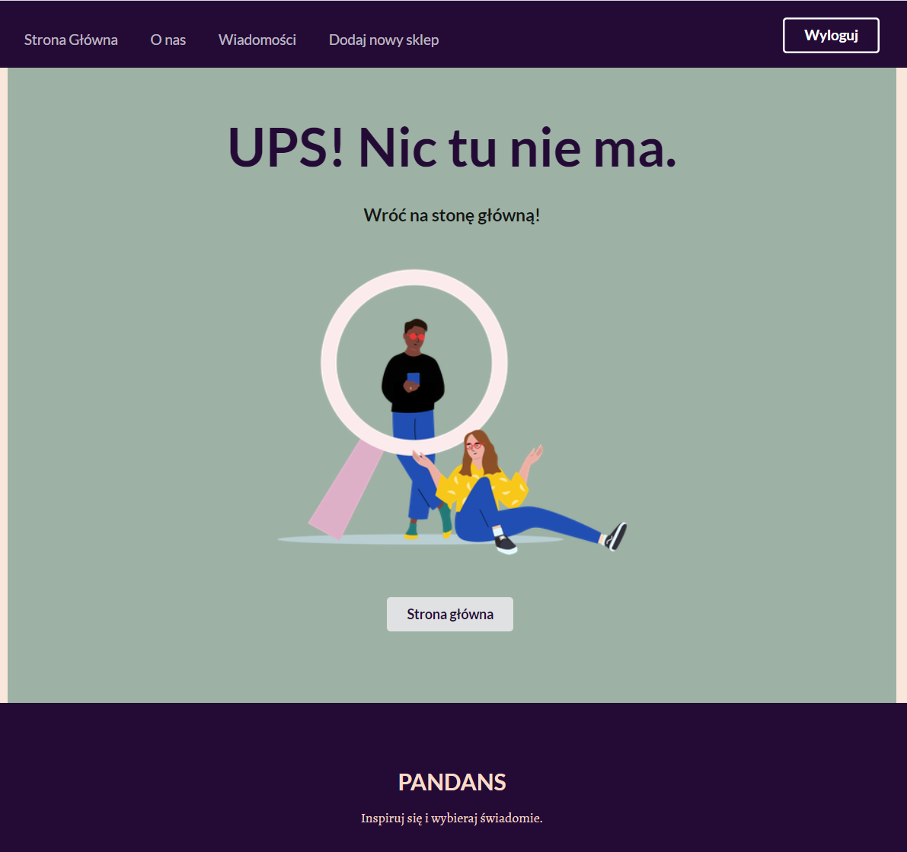

# PANDANS FRONTEND
"PANDANS" to aplikacja typu SPA, która kataloguje polskie firmy, które wytwarzają różne produkty. W celu poprawnia danych łączy się z specjalnie stworzpnym w tym celu backendem Node.js.

Strona pozwala na:
* Przeglądanie sklepów dodanych przez administratora
* Wysyłanie wiadomości do administratora strony
* **(ADMIN)** Logowanie i wylogywanie się
* **(ADMIN)** Dodawanie nowych sklepów
* **(ADMIN)** Edytowanie i usuwanie dodanych sklepów
* **(ADMIN)** Odczytywanie wiadomości przesłanych przez użytkowników

Repozytorium backendu: [Pandans Backend](https://github.com/zuzannamatyjasik/pandansBack).

## **Użyte technologie**
* React (Biblioteka JavaScript)
* Semantic UI (Technologia formatkowa)

## **Użyte biblioteki**
* React
* React Router
* Axios
* Semantic UI React

## **Funkcjonalność strony**
Na poniższym gifie można zobaczyć dwie główne strony dostępne dla użytkownika
* Strona główna - przeglądanie sklepów
* Strona "O nas" z formularzem do kontaktu

Pozostałe dostępne strony:

1. Szczegóły pojedyneczego sklepu

2. Podziękowania po wysłaniu wiadomości ze strony "O nas"

3. (ADMIN) Logowanie (wersja na urządzenie mobilne)

4. (ADMIN) Dodawanie nowego sklepu

5. (ADMIN) Edytowanie sklepu

6. (ADMIN) Podgląd wiadomości

7. Błędny link lub akcja

8. Brak dostępu bez autoryzacji
